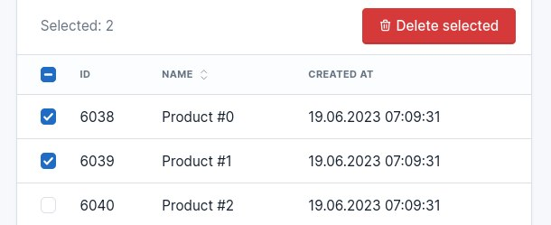

# Adding actions

What is a list of products without the ability of creating and editing the records?
In this bundle, there are _three_ kinds of actions:

* [global actions](#adding-global-actions), displayed above the data table - e.g. "Create new user";
* [batch actions](#adding-batch-actions), requiring the user to select one or more rows, e.g. "Delete selected";
* [row actions](#adding-row-actions), displayed on each row, e.g. "Edit", "Delete";

Similar to data tables, columns and filters, actions are defined using the [type classes](../features/type-classes.md).

## Adding global actions

--

Let's assume that the application has an `app_product_create` route for creating new products.  
The user should be able to click a "Create new product" button above the data table.

To add global action, use the builder's `addAction()` method:

```php # src/DataTable/Type/ProductDataTableType.php
use Kreyu\Bundle\DataTableBundle\DataTableBuilderInterface;
use Kreyu\Bundle\DataTableBundle\Action\Type\ButtonActionType;
use Kreyu\Bundle\DataTableBundle\Type\AbstractDataTableType;

class ProductDataTableType extends AbstractDataTableType
{
    public function buildDataTable(DataTableBuilderInterface $builder, array $options): void
    {
        // Columns, filters and exporters added before...
        
        $builder
            ->addAction('create', ButtonActionType::class, [
                'label' => 'Create new product',
                'href' => $this->urlGenerator->generate('app_product_create'),
                'icon_attr' => [
                    // For example, using Tabler Icons
                    // https://tabler-icons.io/
                    'class' => 'ti ti-plus', 
                ],
            ])
        ;
    }
}
```

The builder's `addAction()` method accepts _three_ arguments:

- action name;
- action type — with a fully qualified class name;
- action options — defined by the action type, used to configure the action;

For reference, see [built-in action types](../components/actions/types.md).

## Adding batch actions

--

Let's assume that the application has an `app_product_delete_batch` route for deleting products.  
The user should be able to select a few rows and click a "Delete selected" button above the data table.

To begin with, make sure the [Symfony UX integration is enabled](../installation.md#enable-the-symfony-ux-integration).
Then, enable the `batch` controller:

```json # assets/controllers.json
{
    "controllers": {
        "@kreyu/data-table-bundle": {
            "batch": {
                "enabled": true
            }
        }
    }
}
```

To add batch action, use the builder's `addBatchAction()` method:

```php # src/DataTable/Type/ProductDataTableType.php
use Kreyu\Bundle\DataTableBundle\DataTableBuilderInterface;
use Kreyu\Bundle\DataTableBundle\Action\Type\ButtonActionType;
use Kreyu\Bundle\DataTableBundle\Type\AbstractDataTableType;

class ProductDataTableType extends AbstractDataTableType
{
    public function buildDataTable(DataTableBuilderInterface $builder, array $options): void
    {
        // Columns, filters and exporters added before...
        
        $builder
            ->addBatchAction('delete', FormActionType::class, [
                'label' => 'Delete selected',
                'action' => $this->urlGenerator->generate('app_product_delete_batch'),
                'method' => 'DELETE',
                'icon_attr' => [
                    // For example, using Tabler Icons
                    // https://tabler-icons.io/
                    'class' => 'ti ti-trash', 
                ],
            ])
        ;
    }
}
```

Similarly to the builder's `addAction()` method, the `addBatchAction()` method accepts _three_ arguments:

- action name;
- action type — with a fully qualified class name;
- action options — defined by the action type, used to configure the action;

For reference, see [built-in action types](../components/actions/types.md).

## Adding row actions

--

Let's assume that the application has an `app_product_show` route for showing details about specific product.
This route requires a product identifier, therefore it has to be a row action.

To add batch action, use the builder's `addRowAction()` method:

```php # src/DataTable/Type/ProductDataTableType.php
use App\Entity\Product;
use Kreyu\Bundle\DataTableBundle\DataTableBuilderInterface;
use Kreyu\Bundle\DataTableBundle\Action\Type\ButtonActionType;
use Kreyu\Bundle\DataTableBundle\Column\Type\ActionsColumnType;
use Kreyu\Bundle\DataTableBundle\Type\AbstractDataTableType;

class ProductDataTableType extends AbstractDataTableType
{
    public function buildDataTable(DataTableBuilderInterface $builder, array $options): void
    {
        // Columns, filters and exporters added before...
        
        $builder
            ->addRowAction('show', ButtonActionType::class, [
                'label' => false,
                'href' => function (Product $product): string {
                    return $this->urlGenerator->generate('app_product_show', [
                        'id' => $product->getId(),
                    ]);
                },
                'icon_attr' => [
                    // For example, using Tabler Icons
                    // https://tabler-icons.io/
                    'class' => 'ti ti-user icon', 
                ],
            ])
        ;
    }
}
```

Similarly to the builder's `addAction()` and `addBatchAction()` methods, the `addRowAction()` method accepts _three_ arguments:

- action name;
- action type — with a fully qualified class name;
- action options — defined by the action type, used to configure the action;

For reference, see [built-in action types](../components/actions/types.md).

## Enabling action confirmation

Clicking on the delete action immediately removes the products — in some cases it may be fine, but dangerous actions should be confirmable by the user.


By default, actions are **not** confirmable, because their `confirmation` option equals `false`. To change that, set the option to `true`:

```php # src/DataTable/Type/ProductDataTableType.php
use App\Entity\Product;
use Kreyu\Bundle\DataTableBundle\Action\Type\FormActionType;
use Kreyu\Bundle\DataTableBundle\Column\Type\ActionsColumnType;
use Kreyu\Bundle\DataTableBundle\Type\AbstractDataTableType;

class ProductDataTableType extends AbstractDataTableType
{
    public function buildDataTable(DataTableBuilderInterface $builder, array $options): void
    {
        // Columns, filters and exporters added before...
        
        $builder
            ->addColumn('actions', ActionsColumnType::class, [
                'actions' => [
                    'update' => [
                        // Configuration added before...
                    ],
                    'delete' => [
                        'type' => FormActionType::class,
                        'type_options' => [
                            // Other action type options defined before...
                            'confirmation' => true,
                        ],
                    ],
                ],
            ])
        ;
    }
}
```

Now that the data table seems to be complete, let's focus on something really special — [a personalization](../basic-usage/enabling-persistence.md), where the user can decide which columns are visible, or even their order!
