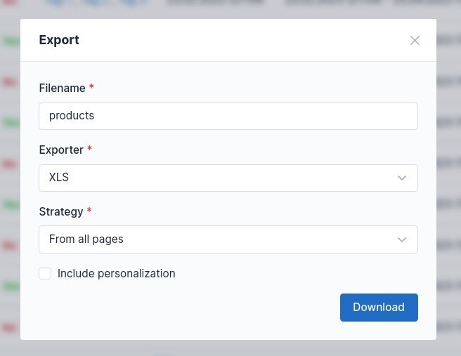

# Exporting

The data tables can be _exported_, with use of the [exporters](../reference/exporters/types.md).



## Prerequisites

The built-in exporter types require [PhpSpreadsheet](https://phpspreadsheet.readthedocs.io/en/latest/).
This library is not included as a bundle dependency, therefore, make sure it is installed:

```bash
$ composer require phpoffice/phpspreadsheet
```

## Toggling the feature

By default, the exporting feature is **enabled** for every data table.
This can be configured with the `exporting_enabled` option:

+++ Globally (YAML)
```yaml # config/packages/kreyu_data_table.yaml
kreyu_data_table:
  defaults:
    exporting:
      enabled: true
```
+++ Globally (PHP)
```php # config/packages/kreyu_data_table.php
use Symfony\Config\KreyuDataTableConfig;

return static function (KreyuDataTableConfig $config) {
    $defaults = $config->defaults();
    $defaults->exporting()->enabled(true);
};
```
+++ For data table type
```php # src/DataTable/Type/ProductDataTable.php
use Kreyu\Bundle\DataTableBundle\Type\AbstractDataTableType;
use Symfony\Component\OptionsResolver\OptionsResolver;

class ProductDataTableType extends AbstractDataTableType
{
    public function configureOptions(OptionsResolver $resolver): void
    {
        $resolver->setDefaults([
            'exporting_enabled' => true,
        ]);
    }
}
```
+++ For specific data table
```php # src/Controller/ProductController.php
use App\DataTable\Type\ProductDataTableType;
use Kreyu\Bundle\DataTableBundle\DataTableFactoryAwareTrait;
use Symfony\Bundle\FrameworkBundle\Controller\AbstractController;

class ProductController extends AbstractController
{
    use DataTableFactoryAwareTrait;
    
    public function index()
    {
        $dataTable = $this->createDataTable(
            type: ProductDataTableType::class, 
            query: $query,
            options: [
                'exporting_enabled' => true,
            ],
        );
    }
}
```
+++

!!! Enabling the feature does not mean that any column will be exportable by itself.
By default, columns **are not** exportable.
!!!

### Making the columns exportable

To make any column exportable, use its `export` option:

```php # src/DataTable/Type/ProductDataTableType.php
use Kreyu\Bundle\DataTableBundle\DataTableBuilderInterface;
use Kreyu\Bundle\DataTableBundle\Column\Type\NumberColumnType;
use Kreyu\Bundle\DataTableBundle\Type\AbstractDataTableType;

class ProductDataTableType extends AbstractDataTableType
{
    public function buildDataTable(DataTableBuilderInterface $builder, array $options): void
    {
        $builder
            ->addColumn('id', NumberColumnType::class, [
                'export' => true,
            ])
        ;
    }
}
```

The column can be configured separately for the export by providing the array in the `export` option.
For example, to change the label of the column in the export:

```php # src/DataTable/Type/ProductDataTableType.php
use Kreyu\Bundle\DataTableBundle\DataTableBuilderInterface;
use Kreyu\Bundle\DataTableBundle\Column\Type\TextColumnType;
use Kreyu\Bundle\DataTableBundle\Type\AbstractDataTableType;

class ProductDataTableType extends AbstractDataTableType
{
    public function buildDataTable(DataTableBuilderInterface $builder, array $options): void
    {
        $builder
            ->addColumn('category', TextColumnType::class, [
                'export' => [
                    'label' => 'Category Name',
                ],
            ])
        ;
    }
}
```

## Adding the exporters

To add exporter, use the builder's `addExporter()` method on the data table builder:

```php # src/DataTable/Type/ProductDataTableType.php
use Kreyu\Bundle\DataTableBundle\DataTableBuilderInterface;
use Kreyu\Bundle\DataTableBundle\Type\AbstractDataTableType;
use Kreyu\Bundle\DataTableBundle\Bridge\PhpSpreadsheet\Exporter\Type\CsvExporterType;
use Kreyu\Bundle\DataTableBundle\Bridge\PhpSpreadsheet\Exporter\Type\XlsxExporterType;

class ProductDataTableType extends AbstractDataTableType
{
    public function buildDataTable(DataTableBuilderInterface $builder, array $options): void
    {
        $builder
            ->addExporter('csv', CsvExporterType::class)
            ->addExporter('xlsx', XlsxExporterType::class)
        ;
    }
}
```

The builder's `addExporter()` method accepts _three_ arguments:

- exporter name;
- exporter type — with a fully qualified class name;
- exporter options — defined by the exporter type, used to configure the exporter;

For reference, see [built-in exporter types](../reference/exporters/types.md).

## Adding multiple exporters of the same type

Let's think of a scenario where the user wants to export the data table to CSV format,
but there's a catch — it must be possible to export as either comma or semicolon separated file.

```php # src/DataTable/Type/ProductDataTableType.php
use Kreyu\Bundle\DataTableBundle\Type\AbstractDataTableType;
use Kreyu\Bundle\DataTableBundle\DataTableBuilderInterface;

class ProductDataTableType extends AbstractDataTableType
{
    public function buildDataTable(DataTableBuilderInterface $builder, array $options): void
    {
        $builder
            ->addExporter('csv_comma', CsvExporterType::class, [
                'label' => 'CSV (separated by comma)',
                'delimiter' => ',',
            ])
            ->addExporter('csv_semicolon', CsvExporterType::class, [
                'label' => 'CSV (separated by semicolon)',
                'delimiter' => ';',
            ])
            ->addExporter('xlsx', XlsxExporterType::class)
        ;
    }
}
```

## Downloading the file

To download an export file, use the `export()` method on the data table.

If you're using data tables in controllers, use it in combination with `isExporting()` method:

```php #15-17 src/Controller/ProductController.php
use App\DataTable\Type\ProductDataTableType;
use Kreyu\Bundle\DataTableBundle\DataTableFactoryAwareTrait;
use Symfony\Bundle\FrameworkBundle\Controller\AbstractController;
use Symfony\Component\HttpFoundation\Request;

class ProductController extends AbstractController
{
    use DataTableFactoryAwareTrait;

    public function index(Request $request)
    {
        $dataTable = $this->createDataTable(ProductDataTableType::class);
        $dataTable->handleRequest($request);

        if ($dataTable->isExporting()) {
            return $this->file($dataTable->export());
        }
    }
}
```

## Exporting without user input

To export the data table manually, without user input, use the `export()` method directly: 

```php #13-14 src/Controller/ProductController.php
use App\DataTable\Type\ProductDataTableType;
use Kreyu\Bundle\DataTableBundle\DataTableFactoryAwareTrait;
use Symfony\Bundle\FrameworkBundle\Controller\AbstractController;

class ProductController extends AbstractController
{
    use DataTableFactoryAwareTrait;

    public function index()
    {
        $dataTable = $this->createDataTable(ProductDataTableType::class);

        // An instance of ExportFile, which extends the HttpFoundation File object
        $file = $dataTable->export();
        
        // For example, save it manually:
        $file->move(__DIR__);
        
        // Or return a BinaryFileResponse to download it in browser:   
        return $this->file($file);
    }
}
```

If the data table has no specified exporters, this will result in an exception:

> Unable to create export data from data table without exporters

By default, the export will contain records from **all pages**.
Also, if enabled, the personalization will be **included**.
To change this behaviour, either configure the data table type's default export data:

```php # src/DataTable/Type/ProductDataTableType.php
use Kreyu\Bundle\DataTableBundle\DataTableBuilderInterface;
use Kreyu\Bundle\DataTableBundle\Type\AbstractDataTableType;
use Kreyu\Bundle\DataTableBundle\Exporter\ExportData;
use Kreyu\Bundle\DataTableBundle\Exporter\ExportStrategy;

class ProductDataTableType extends AbstractDataTableType
{
    public function buildDataTable(DataTableBuilderInterface $builder, array $options): void
    {
        $exporters = $builder->getExporters();

        $builder->setDefaultPersonalizationData(ExportData::fromArray([
            'filename' => 'products',
            'exporter' => $exporters[0],
            'strategy' => ExportStrategy::INCLUDE_CURRENT_PAGE,
            'include_personalization' => false,
        ]));
    }
}
```

or pass the export data directly to the `export()` method:

```php #13-14,16 src/Controller/ProductController.php
use App\DataTable\Type\ProductDataTableType;
use Kreyu\Bundle\DataTableBundle\DataTableFactoryAwareTrait;
use Symfony\Bundle\FrameworkBundle\Controller\AbstractController;

class ProductController extends AbstractController
{
    use DataTableFactoryAwareTrait;

    public function index()
    {
        $dataTable = $this->createDataTable(ProductDataTableType::class);

        $exportData = ExportData::fromDataTable($dataTable);
        $exportData->includePersonalization = false; 
        
        $file = $dataTable->export($exportData);
        
        // ...
    }
}
```
